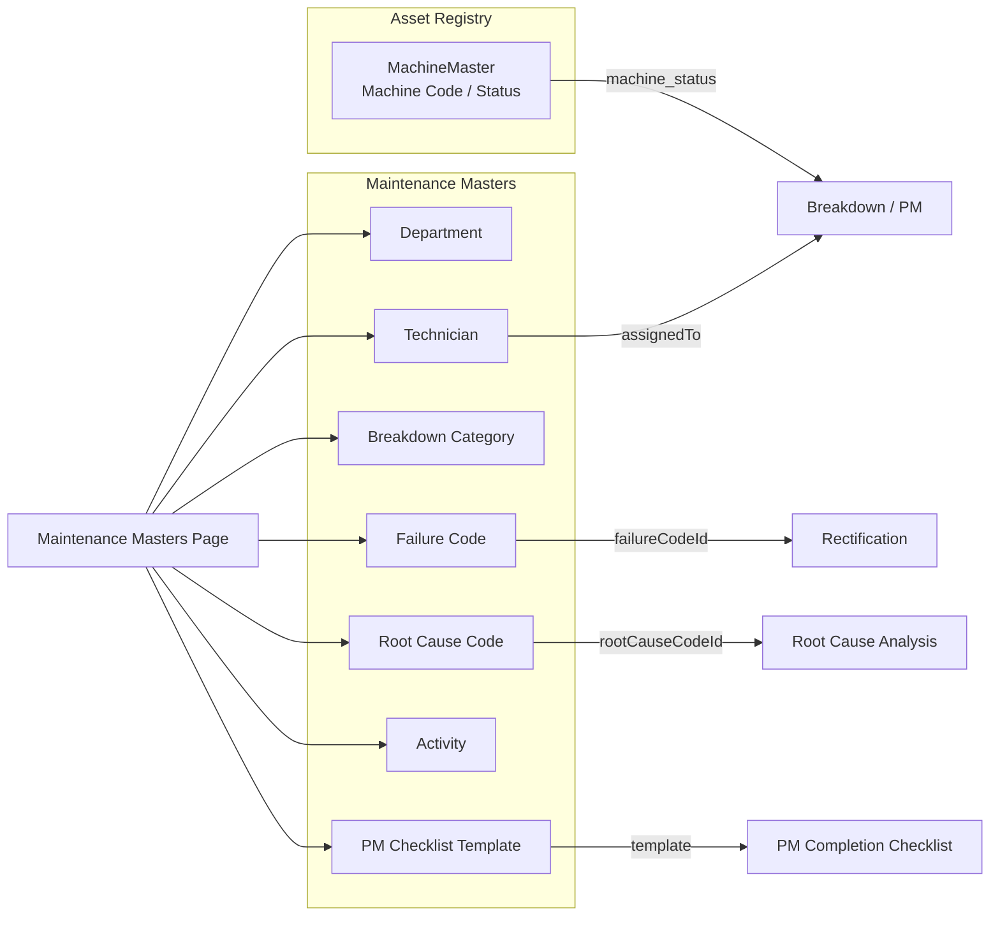
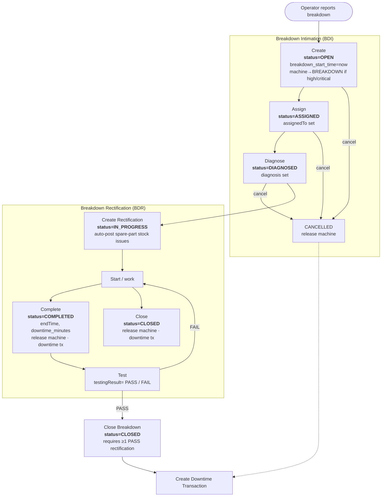
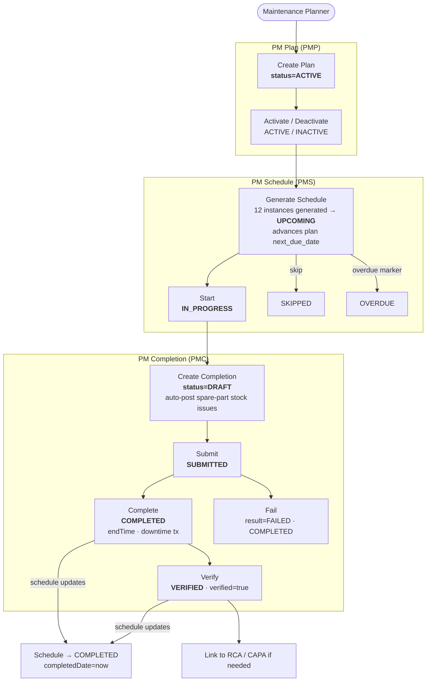
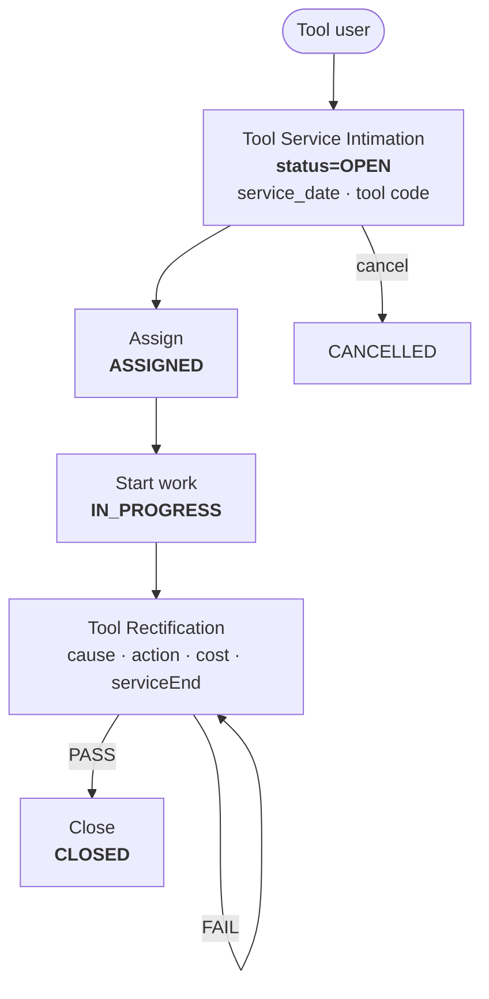
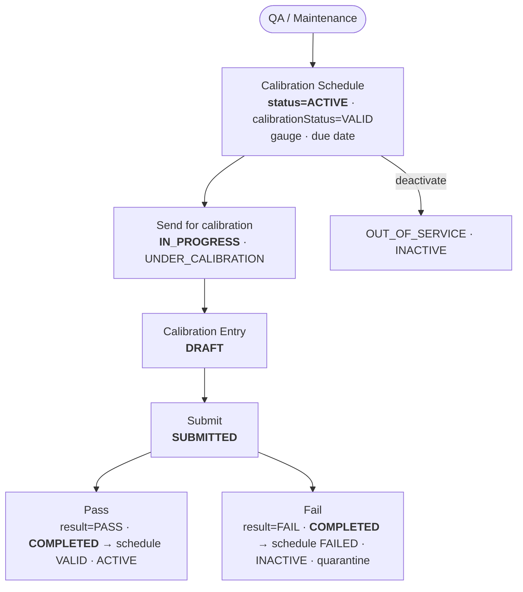
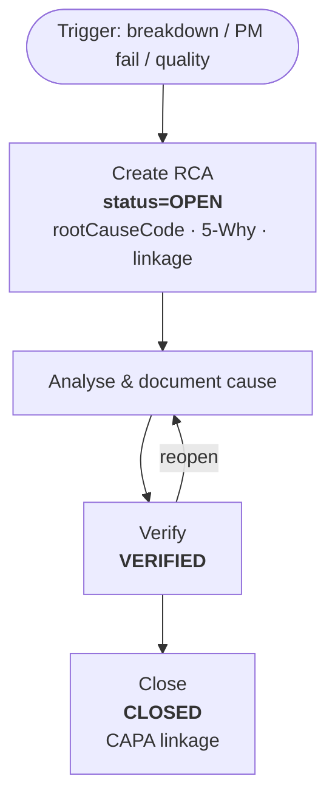

# Maintenance Module - Functional Requirements Specification (FRS)

**Version:** 1.0
**Date:** August 28, 2026
**Module:** Maintenance (Manufacturing ERP)
**Status:** Active Development

---

## Table of Contents

1. Module Overview
2. Navigation & Screens
3. Masters & Reference Data
4. Master Workflow Diagram
5. Breakdown Workflow (Corrective / Unplanned Maintenance)
6. Preventive Maintenance (PM) Workflow
7. Tool Service Workflow
8. Calibration Workflow
9. Root Cause Analysis (RCA) Workflow
10. Downtime & Cost Accounting
11. Notifications & Escalation
12. Reports & Analytics
13. Workflow State Machines
14. Validation Rules
15. Gap Analysis

---

## 1. Module Overview

### 1.1 Purpose
The Maintenance module manages the complete equipment maintenance lifecycle across three pillars:

- **Corrective maintenance** — unplanned breakdowns (intimation → assignment → rectification → closure).
- **Preventive maintenance (PM)** — scheduled maintenance plans → schedules → checklist completion → verification.
- **Support activities** — tool service, calibration, utilities (power/water), root-cause analysis and downtime/cost analytics.

### 1.2 Architecture
- **Backend:** Spring Boot 4.1.0, Java 25, PostgreSQL
- **Frontend:** React 19 + Vite 8 + TypeScript
- **Controller:** `MaintenanceController` (`/api/v1/maintenance/...`)
- **Service:** `MaintenanceService`
- **Workflow enrichment:** `WorkflowEngine` + `EscalationEngine`
- **Stock integration:** rectification / PM-completion spare part issues auto-post to inventory (`SparePartStockService`, §7.3)

### 1.3 Navigation
Maintenance module tabs: Dashboard | Breakdown Intimation | Breakdown Rectification | PM Plan | PM Schedule | PM Completion | Tool Service | Calibration | Utilities | RCA | Analysis | Reports.

Frontend screens under `src/pages/maintenance/`:
- `breakdown/BreakdownIntimationScreen`, `breakdown/BreakdownRectificationScreen`
- `pm/PmPlanScreen`, `pm/PmScheduleScreen`, `pm/PmCompletionScreen`
- `tools/ToolServiceIntimationScreen`, `tools/ToolServiceRectificationScreen`
- `calibration/CalibrationScheduleScreen`, `calibration/CalibrationEntryScreen`
- `utilities/PowerConsumptionScreen`, `utilities/WaterConsumptionScreen`
- `analysis/RootCauseAnalysisScreen`, `analysis/MaintenanceAnalysisScreen`
- `dashboard/MaintenanceDashboard`, `reports/*`, `notifications/NotificationLogPage`, `masters/MaintenanceMastersPage`, `CostRollupPage`

---

## 2. Navigation & Screens

| Area | Screen | Purpose |
|------|--------|---------|
| Breakdown | Intimation | Report machine failure, set category/priority/impact |
| Breakdown | Rectification | Record cause, corrective action, spare parts, labour, testing |
| PM | Plan | Define recurrence frequency, checklist, assignee |
| PM | Schedule | Auto-generated instances (UPCOMING/OVERDUE) |
| PM | Completion | Execute and verify a scheduled PM against a checklist |
| Tool | Service Intimation | Notify tool requiring service |
| Tool | Rectification | Record tool repair / service action |
| Calibration | Schedule / Entry | Schedule and record gauge calibration |
| Analysis | RCA | 5-Why / root-cause and CAPA linkage |
| Utilities | Power / Water | Metered consumption logging |
| Analysis | Dashboard / MTBF / downtime | Reliability & cost analytics |

---

## 3. Masters & Reference Data

| Master | Entity | Notes |
|--------|--------|-------|
| Department | `DepartmentMaster` | Maintenance departments |
| Technician | `TechnicianMaster` | Assignable technicians |
| Breakdown Category | `BreakdownCategoryMaster` | Classification of failures |
| Failure Code | `FailureCodeMaster` | Symptom/cause codes |
| Root Cause Code | `RootCauseCodeMaster` | RCA reference codes |
| Activity | `MaintenanceActivityMaster` | Standard activities |
| PM Checklist Template | `PmChecklistTemplate` | Reusable checklist templates |
| Machine | `MachineMaster` | Asset registry (shared with Planning) |

---

## 4. Master Workflow Diagram



---

## 5. Breakdown Workflow (Corrective / Unplanned Maintenance)

Business flow: operator intimation → planner assigns → diagnosis → rectification (with testing) → close. Document numbers: `BDI-{YYYY}-{seq}` (intimation), `BDR-{YYYY}-{seq}` (rectification).



**Notes**
- `close` on a breakdown is blocked unless **at least one** rectification has `testingResult = PASS` (BR-03).
- **Rectification actions:** `start`, `complete` (sets endTime, computes `downtime_minutes`, releases machine, writes downtime tx), `close`, `pass`, `fail`.
- Downtime is recorded as a `DowntimeTransaction` and feeds MTBF, downtime and cost analytics.

---

## 6. Preventive Maintenance (PM) Workflow

Three linked records: **PM Plan** (definition) → **PM Schedule** (instances) → **PM Completion** (execution + verification). Document numbers: `PMP-{YYYY}-{seq}`, `PMS-{YYYY}-{seq}`, `PMC-{YYYY}-{seq}`.



**Notes**
- **PM Plan actions:** `activate` (`ACTIVE`), `deactivate` (`INACTIVE`).
- **PM Schedule actions:** `start` (`IN_PROGRESS`), `complete` (`COMPLETED` + completedDate), `skip` (`SKIPPED`), `overdue` (`OVERDUE`).
- **PM Completion actions:** `submit` (`SUBMITTED`), `complete` (`COMPLETED`, writes downtime tx), `verify` (`VERIFIED`), `fail` (`result=FAILED`, `COMPLETED`). Completing/verifying rolls the linked schedule to `COMPLETED`.
- **Checklist** items (`PmCompletionChecklistItem`) are batch-created against a completion from `PmChecklistTemplate`.

---

## 7. Tool Service Workflow

Mirrors breakdown flow but for tools rather than machines. Document numbers: `TSI-{YYYY}-{seq}` (intimation), tool rectification follows.



---

## 8. Calibration Workflow

Calibration follows a schedule (gauge lifecycle) and an entry (execution) pair. Schedule statuses: `ACTIVE` / `IN_PROGRESS` / `INACTIVE`, with a separate `calibrationStatus` of `UNDER_CALIBRATION` / `VALID` / `FAILED` / `OUT_OF_SERVICE`. Entry statuses: `DRAFT` / `SUBMITTED` / `COMPLETED`.



---

## 9. Root Cause Analysis (RCA) Workflow



---

## 10. Downtime & Cost Accounting

Breakdown rectification, PM completion and tool rectification auto-write `DowntimeTransaction` records and post spare-part stock issues. These feed:

- **MTBF** — mean time between failures per machine (`/mtbf/{machineCode}`, `/analysis/mtbf`).
- **Downtime analysis** — by category, priority, machine.
- **Cost analysis** — labour + spare parts + service; roll-up available via `CostRollupController`.
- **Reports** — breakdown, PM, machine history, spare parts, cost, downtime cost.

---

## 11. Notifications & Escalation

- `NotificationLog` records generated notifications per source (`sourceType`/`sourceId`) and recipient.
- `EscalationEngine` drives overdue PM schedules and unresolved breakdowns toward owners.
- Dashboard surfaces counts of `OPEN` / `DIAGNOSED` / `IN_PROGRESS` / `OVERDUE` items.

---

## 12. Reports & Analytics

| Endpoint | Description |
|----------|-------------|
| `/maintenance/dashboard` | KPI summary |
| `/maintenance/mtbf/{machineCode}` | Single-machine MTBF |
| `/maintenance/analysis/downtime` | Downtime list |
| `/maintenance/analysis/downtime/categories` | Downtime by category |
| `/maintenance/analysis/downtime/priority` | Downtime by priority |
| `/maintenance/analysis/mtbf` | MTBF across machines |
| `/maintenance/analysis/cost` | Maintenance cost analysis |
| `/maintenance/reports/breakdown` | Breakdown report (filter by machine/category/status) |
| `/maintenance/reports/pm` | PM report |
| `/maintenance/reports/machine-history/{machineCode}` | Full machine history |
| `/maintenance/reports/spare-parts` | Spare parts usage |
| `/maintenance/reports/cost` | Cost report (date range) |
| `/maintenance/reports/downtime-cost` | Downtime cost report |

---

## 13. Workflow State Machines

### 13.1 Breakdown Intimation
```
OPEN -> ASSIGNED -> DIAGNOSED -> [rectification] -> CLOSED
  |        |           |
  +--------+-----------+-----> CANCELLED
```
`CLOSED` requires ≥1 rectification with `testingResult=PASS`.

### 13.2 Breakdown Rectification
```
IN_PROGRESS -> COMPLETED -> (testingResult: PASS / FAIL)
            -> CLOSED
```
`complete`/`close` release the machine and create a downtime transaction.

### 13.3 PM Plan
```
ACTIVE <-> INACTIVE
```

### 13.4 PM Schedule
```
UPCOMING -> IN_PROGRESS -> COMPLETED   (rolled via completion)
UPCOMING -> SKIPPED
UPCOMING -> OVERDUE
```

### 13.5 PM Completion
```
DRAFT -> SUBMITTED -> COMPLETED -> VERIFIED
                \-> COMPLETED (result=FAILED)
```
`COMPLETED`/`VERIFIED` roll the linked schedule to `COMPLETED`.

### 13.6 Tool Service
```
OPEN -> ASSIGNED -> IN_PROGRESS -> [rectification] -> CLOSED / CANCELLED
```

### 13.7 Calibration Schedule
```
ACTIVE (VALID) -> IN_PROGRESS (UNDER_CALIBRATION) -> ACTIVE (VALID)  [entry PASS]
                                                 -> INACTIVE (FAILED) [entry FAIL]
INACTIVE (OUT_OF_SERVICE)                        [action: deactivate]
```

### 13.8 Calibration Entry
```
DRAFT -> SUBMITTED -> COMPLETED  (result: PASS / FAIL)
```

### 13.9 RCA
```
OPEN -> VERIFIED -> CLOSED
  |        |
  +--------+-----> (reopen) -> OPEN
```

---

## 14. Validation Rules

| ID | Rule | Severity |
|----|------|----------|
| BR-01 | Machine code must exist in MachineMaster on intimation | Error |
| BR-02 | A breakdown cannot be closed with no rectification | Error |
| BR-03 | A breakdown cannot be closed unless a rectification has `testingResult=PASS` | Error |
| BR-04 | CLOSED breakdowns / rectifications cannot be deleted | Error |
| BR-05 | COMPLETED or VERIFIED PM completions cannot be deleted | Error |
| BR-06 | COMPLETED PM schedules cannot be deleted | Error |
| BR-07 | INACTIVE PM plans cannot be deleted | Error |
| BR-08 | High/critical breakdown sets machine status to `BREAKDOWN` | Auto |
| BR-09 | Rectification and PM-completion spare parts auto-post stock issues | Auto (§7.3) |
| BR-10 | Downtime minutes auto-computed from start/end times | Auto |
| BR-11 | Overdue PM schedules trigger escalation + notification | Auto |

---

## 15. Gap Analysis

| # | Gap | Status | Notes |
|---|-----|--------|-------|
| M-01 | Spare-parts stock issue posting is fire-and-forget (catch-and-log) | Open | Optional: async outbox + retry refactor |
| M-02 | External-vendor (service) cost captured, but no PO-linkage for third-party maintenance | Open | Consider linking service cost to a purchase doc |
| M-03 | Calibration "next due date" computation not shown in controller actions | Verify | Confirm recalculation logic |
| M-04 | No formal labour-hour costing rate table per technician | Open | Enables accurate M-03 cost roll-up |
| M-05 | PM completion checklist available, but no per-item PASS/FAIL gate before verify | Open | Could enforce all checklist items pass before `VERIFIED` |
| M-06 | Utilities (power/water) logged but not tied to cost roll-up or carbon reporting | Open | Optional enhancement |
